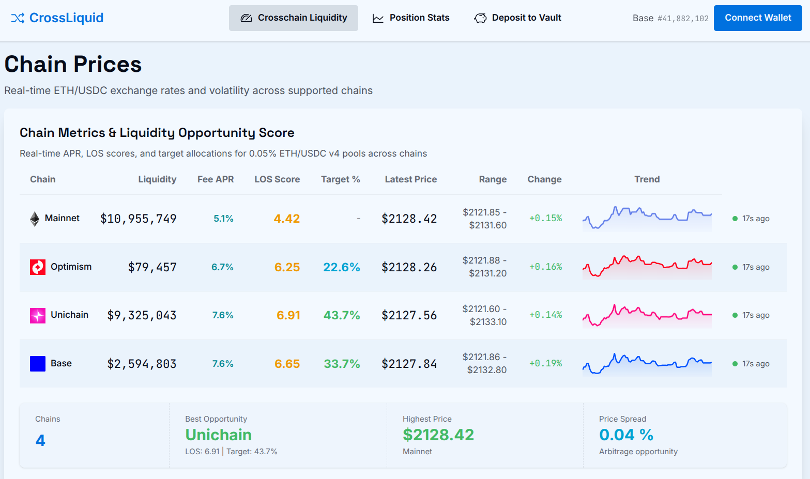
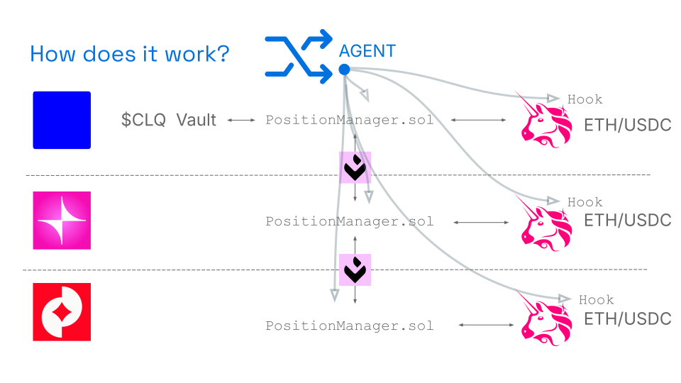

# CrossLiquid - Agentic Crosschain LP

**[Live Demo](https://crossliquid.duckdns.org/)** | HackMoney 2026 Submission



# Goal

CrossLiquid creates agent-managed, cross-chain liquidity for earning fees on USDC-ETH pairs across Uniswap v4 pools.

Concentrated liquidity can generate great yield, but it comes with amplified impermanent loss and requires constant rebalancing. The best opportunities shift between chains. Managing this manually is a hassle.

CrossLiquid's agent automatically:
- Manages and rebalances concentrated positions
- Moves funds to whichever chain has the best yield
- Protects against loss-versus-rebalancing and just-in-time liquidity sniping

## Current state

**Working:**
- Users can deposit ETH into a vault on Base, get $CLQ tokens in return
- Off-chain agent scores liquidity opportunities per chain
- Agent swaps between ETH and USDC via li.fi and deploys into ETH-USDC Uniswap v4 pools
- Agent moves funds between chains via li.fi
- Automated deployment and rebalancing of liquidity to keep positions in optimal tick range
- Data collection for scoring chains is live and visible on the frontend

**In progress:**
- Fully automated cross-chain rebalance loop (works, but triggered via manual CLI commands)
- Dynamic fee adjustment based on volatility (hook infrastructure is ready, adjustment logic not yet implemented)



### Chains

CrossLiquid runs locally on a foundry node, and because li.fi is not possible to test locally I deployed it on both Base and Unichain for demo use.

## Components

### 1. On-chain Vault (`CrossLiquidVault.sol`)

A vault on Base that accepts deposits and mints `$CLQ` tokens. The intent is to keep a small liquid buffer on Base and repatriate from LP positions as needed.

### 2. Position manager (`PositionManager.sol`)

Owns the Uniswap v4 positions on each chain, exposes position/fee-growth lenses. It has a "operator" address that can execute calls as the manager to do swaps, add/remove liquidity and bridge funds to/from manager contracts on other chains.

### 3. Uniswap v4 hook (`VolatilityFeeHook.sol`)

CrossLiquid deposits into Uniswap v4 pools with this custom hook. The hook infrastructure allows for dynamic fee adjustment based on volatility (implementation in progress).

### 4. Off-chain agent (`agent/`)

- Monitors pools across chains and computes a Liquidity Opportunity Score (LOS)
- Executes swaps via Li.FI and prepares per-chain LP actions
- Tracks in-flight actions to avoid double-adjusting

### 5. Frontend (`web/`)

Svelte UI to view liquidity opportunity scores, track the status of the LP positions and deposit funds into the vault.

## Liquidity Opportunity Score (LOS)

The Liquidity Opportunity Score (LOS) that the agent uses to score chains against each other is calculated based on:
- **Historic yield** - tracks the hook-free 0.05% ETH/USDC univ4 pool on each chain and measures fee growth. Higher yield is better.
- **Historic volatility** - higher volatility means more trading activity and fees. However, prices across all chains are extremely highly correlated, so this variable rarely differs significantly between chains.
- **Gas fees** - higher gas costs reduce net yield and are weighted negatively.


## Deferred / future work

- hook: Make hook prevent other liquidity from being added to the pool (anti-JIT sniping)
- hook: Include other on-chain price data to instantly react to big price swings with higher fees
- vault: Redeem in the UI and make sure that there's always some liquid ETH in the vault
- agent: Finish fully automated cross-chain rebalancing loop
- Expand to more pairs beyond USDC-ETH
- Move idle funds into lending protocols for extra yield
- Simulator for tweaking how to do rebalancing, tick width, etc. to maximize yield while mitigating impermanent loss

This project was forked off [svelte-scaffold-eth: A modern starter template for building Ethereum dApps with SvelteKit 5, Foundry, and DaisyUI.](https://github.com/mathijs81/svelte-scaffold-eth)

## Quick Start

```bash
# Install Foundry (using mise - recommended)
mise install

# Set up foundry/lib/forge-std submodule
git submodule update --init --recursive

# Install dependencies for both foundry and web
pnpm install

# Start local Foundry node (in terminal 1) and deploy contracts
just run-chain

# Start the agent (terminal 2)
cd agent; pnpm dev

# Start the web dev server (in terminal 3)
cd web; pnpm dev

# Open http://localhost:5173
```

Your app is now running with:

- Local Foundry node on `http://localhost:8545`
- CrossLiquid contracts (Vault, PositionManager, VolatilityFeeHook) deployed
- Uniswap v4 infrastructure (PoolManager, USDC, WETH, initialized pool)
- Agent running locally
- Web frontend running locally


## License

MIT

## Acknowledgments

[HackMoney 2026 hackathon](https://ethglobal.com/events/hackmoney2026) for which this project is a submission

**AI tools/agents**

- **Gemini** explained inner workings of Uniswapv4 to me and helped me brainstorm and sharpen the idea of this hack

- **Claude Code** helped with implementing big parts of the frontend, local deployment of Uniswap and Univ4 hook.

- **OpenCode** for mostly UI tweaks

**Dev projects**

- [svelte-scaffold-eth](https://github.com/mathijs81/svelte-scaffold-eth)
- [scaffold-eth-2](https://github.com/scaffold-eth/scaffold-eth-2) - The original inspiration for svelte-scaffold-eth
- [OpenZeppelin SDK](https://github.com/OpenZeppelin/) for smart contract development
- [@wagmi/core](https://wagmi.sh/core) - Framework-agnostic Ethereum library
- [viem](https://viem.sh) - TypeScript library for Ethereum
- [Foundry](https://getfoundry.sh) - Fast, portable, and modular toolkit for Ethereum
- [SvelteKit](https://kit.svelte.dev) - The fastest way to build web applications
- [DaisyUI](https://daisyui.com) - Beautiful, themeable UI components
